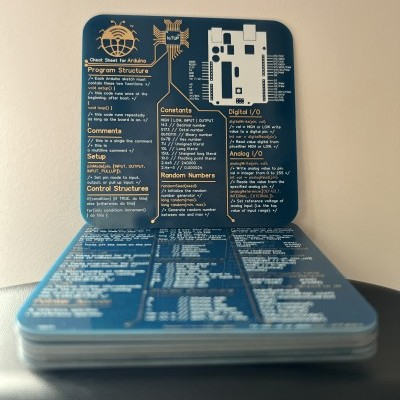
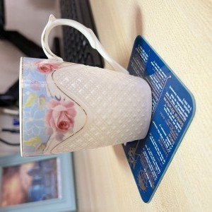

# Arduino Cheat Sheet Coaster, Gold Printed Circuit Board, Unique Gift for Electronic Engineers, Scientists, and Students

{ align=left width:400px }

I have designed this lovely coaster that reminds anyone of the perfect engineering embedded in Arduino after every sip of their coffee. It is made of high-quality printed circuit board (PCB) material, lead-free, and gold plated with nice round corners. It feels very professional and is a must if you work with electronic devices. The content of the cheat sheet is carefully chosen by me after working with Arduino for many years to include the mostly used commands and libraries.

The coaster has the drawing of Arduino Uno board pin map for quick reference, making it easy to work with Arduino in lab.

The item has the following specifications: 

Dimensions: 10 cm x 10 cm [3.94" x 3.94"]
Thickness: 1.6 mm [0.04"]
Weight: 30g

## Order Options

{ align=right width:400px margin-left:10px }

You can order this coaster from my online shops (IoTUp) on these online marketplaces (**for 30% discount use "THANKYOU" code at the checkout**):

- [IoTUp Shop on Etsy](https://www.etsy.com/uk/shop/IoTUp) 
- [IoTUp Shop on Amazon](https://www.amazon.co.uk/Coaster-Electronic-Engineers-Scientists-Students/dp/B0B8PHMSVF)

