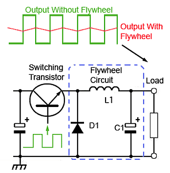
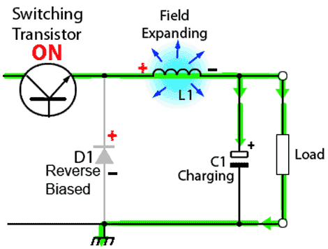
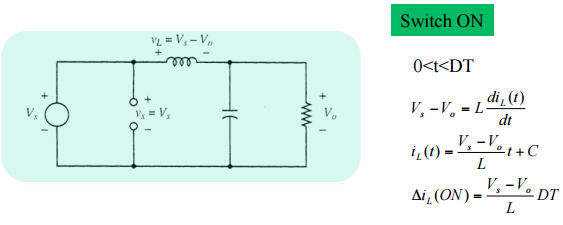
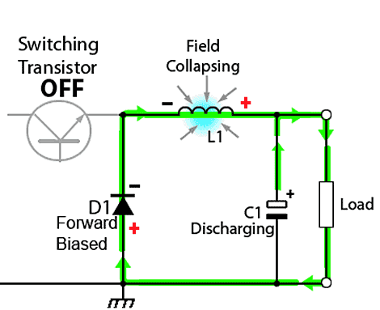
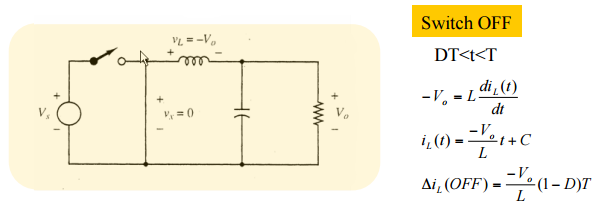
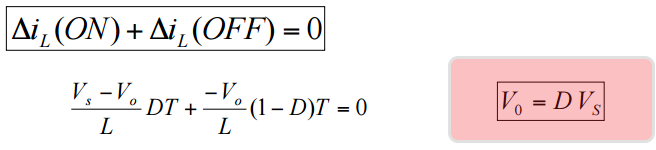
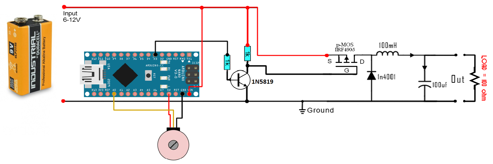
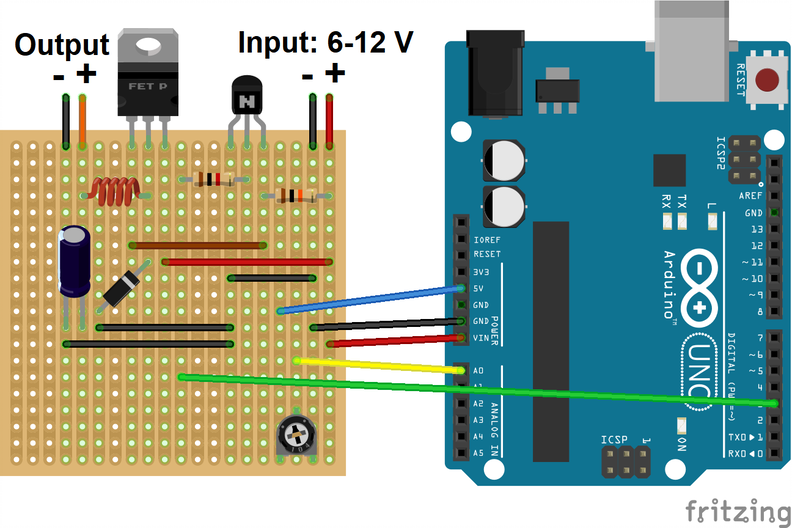

# DC-DC Buck Converter with Arduino Uno

## Video of the Experiment
You can watch the video of this experiment by following this link: 

[](https://www.youtube.com/watch?v=zWer2KIcYE4)

## Introduction
In this experiment, we want to build a cheap DC-DC buck converter using the common electronic components available online. The pulse width modulation (PWM) switching signal is generated using Arduino Uno and drives the gate of P-Channel Metal oxide silicon field effect transistor (MOSFET) through a bipolar junction transistor (BJT).

A buck converter or a step-down converter is a DC-to-DC power converter, which steps down voltage (while stepping up current) from its input (supply) to its output (load). It is a class of switched-mode power supply (SMPS), typically containing at least two semiconductors (a diode and a transistor, although modern buck converters frequently replace the diode with a second transistor used for synchronous rectification) and at least one energy storage element, a capacitor, inductor, or the two in combination. To reduce voltage ripple, filters made of capacitors (sometimes in combination with inductors) are normally added to such a converter's output (load-side filter) and input (supply-side filter). 

First, the theory of DC-DC buck converter is provided. Second, the list of components used in this experiment is provided. Finally, the schematic and the circuit of the DC-DC converter is provided.

## Theory of DC-DC Buck Converter Operation
A basic circuit of a buck converter is provided. In order to study how it works, we will divide it in two stages. The ON and OFF stages. In the ON state, the switch is closed as we can see in the next figure, where the diode is open because the cathode voltage is higher than the anode. 



*Figure 1: Basic circuit for a DC-DC buck converter*

The switching transistor between the input and output of the buck converter continually switches on and off at high frequency. To maintain a continuous output, the circuit uses the energy stored in the inductor L, during the on periods of the switching transistor, to continue supplying the load during the off periods. The circuit operation depends on what is sometimes also called a Flywheel circuit. This is because the circuit acts rather like a mechanical flywheel that, given regularly spaced pulses of energy keeps spinning smoothly (outputting energy) at a steady rate.

When the switch is first closed (on-state), the current will begin to increase, and the inductor will produce an opposing voltage across its terminals in response to the changing current. This voltage drop counteracts the voltage of the source and therefore reduces the net voltage across the load. Over time, the rate of change of current decreases, and the voltage across the inductor also then decreases, increasing the voltage at the load. During this time, the inductor stores energy in the form of a magnetic field. If the switch is opened while the current is still changing, then there will always be a voltage drop across the inductor, so the net voltage at the load will always be less than the input voltage source. When the switch is ON the inductor will charge up and the voltage on the inductor will be the difference between the output and the input. But we also know that the inductor voltage is the inductance L multiplied by the inductor current derivate. As we can see in the next figure, we obtain the ON current through the inductor. 





*Figure 2: ON state of the buck converter*

When the switch is opened again (off-state), the voltage source will be removed from the circuit, and the current will decrease. The decreasing current will produce a voltage drop across the inductor (opposite to the drop at on-state), and now the inductor becomes a Current Source. The stored energy in the inductor's magnetic field supports the current flow through the load. This current, flowing while the input voltage source is disconnected, when concatenated with the current flowing during on-state, totals to current greater than the average input current (being zero during off-state). The "increase" in average current makes up for the reduction in voltage, and ideally preserves the power provided to the load. During the off-state, the inductor is discharging its stored energy into the rest of the circuit. If the switch is closed again before the inductor fully discharges, the voltage at the load will always be greater than zero. In this case the voltage across the inductor is the output voltage. So once again using the next figure formulas we obtain the current of the OFF part.





*Figure 3: OFF state of the buck converter*

Now if we want to obtain the output depending on the input and the duty cycle of the PWM all we have to do is to make the sum of the On and Off current equal to 0. That means that the On current is equal to the Off current. So, this will give us: 



*Figure 4: Input-output voltage equation*

## List of components for the building and testing the DC-DC buck converter

| Component   | Quantity    |
| ----------- | ----------- |
| IRF4905PBF  | 1 |
| 1N5819      | 1 |
| Panasonic 100μF 16V Electrolytic Capacitor| 2 |
| 150 μH ±15% Power Inductor, 2A Idc, 106mΩ Rdc | 1 |
| SS8050DTA NPN Transistor, 1.5 A, 25 V | 1 |
| 1kΩ Resistor | 2 |
| 10kΩ Through Hole Trimmer Potentiometer | 1 |
| Jumper wires (male to male) | 10 |
| 9V battery | 1 |
| 9V battery contact | 1 |
| Arduino Uno with USB cable | 1 |
| Osciloscopte | 1 |
| Breadboard | 1 |

## Building the DC-DC buck converter circuit using Arduino as the PWM source

The Arduino UNO already has a 5V linear voltage regulator that will lower the efficiency of the circuit. So the main goal is to learn how the circuit, the feedback and the PWM signal work in order to achieve the desired output.



*Figure 5: Schematic of Arduino-based DC-DC buck converter*

As you can see in the schematic above we have a potentiometer connected to the analog input A0. With this potentiometer we will choose the output value between 1 and 9 volts since the maximum input voltage in this case is 9V. With the Arduino's ADC we will read a value between 0 and 1024, next, in the code we map that value from 1 to 244 which are the values used with the analogWrite function of the Arduino. With this we will apply a PWM signal on pin D3 where 1 is the lowest duty cycle and 244 the maximum. Since the Arduino digital value is 5V we add a small BJT driver using one S8050 NPN and two resistors of 1k. The output of this driver is connected to the gate of the IRF4905 P-MOSFET.  
 
Connect everything as in the schematic above and upload the next code to your Arduino and start moving the potentiometer. Observe the output on the oscilloscope.

This circuit is able to increase and decrease the voltage and keep that value steady for the same LOAD, in this case a 100 ohm resistor, as we can see in the picture below. But if we change the output load the discharge time of the output will change as well since for lower loads there will be a higher amount of current passing. So if the discharging time is faster or slower the duty cycle should change as well. For that we should add a feedback system to our circuit that would sense the output voltage and correct the PWM duty in order to keep the same desired value. In the next figure, you can find the real connection on the prototyping board with the connection to Arduino UNO. 



## Arduino Code for PWM Generation

``` c
#include <Arduino.h>

//Analog input pin for the potentiometer
int potentiometer_pin = A0; 

// PWM output pin
int pwm_pin = 3;          


void setup() {
  // Adjusts the pin to input mode
  pinMode(potentiometer_pin, INPUT);
  // Adjusts the pin to output mode
  pinMode(pwm_pin, OUTPUT);

  // Adjusts the PWM frequency to 980.39 Hz.
  // By default arduino PWM frequency is 490.20 Hz, 
  // but this value is not high enough to have a stable DC output voltage in low duty cycles.
  TCCR2B = TCCR2B & B11111000 | B00000011;
}

void loop() {  

  // Reads the voltage of the potentiometer to a value between 0 to 1023
  // The resolution of ADC on Arduino is 10 bits.
  int duty_cycle = analogRead(potentiometer_pin);

  // Maps the value from [0 1023] to [0 255] for the PWM function of Arduino
  int duty_cycle_mapped = map(duty_cycle, 0, 1024, 0, 254);

  // Sets the PWM signal duty cyle value, 0->0%, 254->100%
  analogWrite(pwm_pin, duty_cycle_mapped);
}
```
## Important Notes
- Make sure all of the components are connected correctly before connecting the battery.
- Take enough care to keep the battery contact wires not touching each other, otherwise it will be short circuit and the battery becomes hot and loses its energy.
- Don't forget to program the Arduino with the code provided, otherwise you won't see anything on the output.
- Try find the resistor values by their color code. They should be 1k resistors.


## Video of the Experiment
You can watch the video of this experiment by following this link: [Video on Youtube](https://www.youtube.com/watch?v=zWer2KIcYE4)
