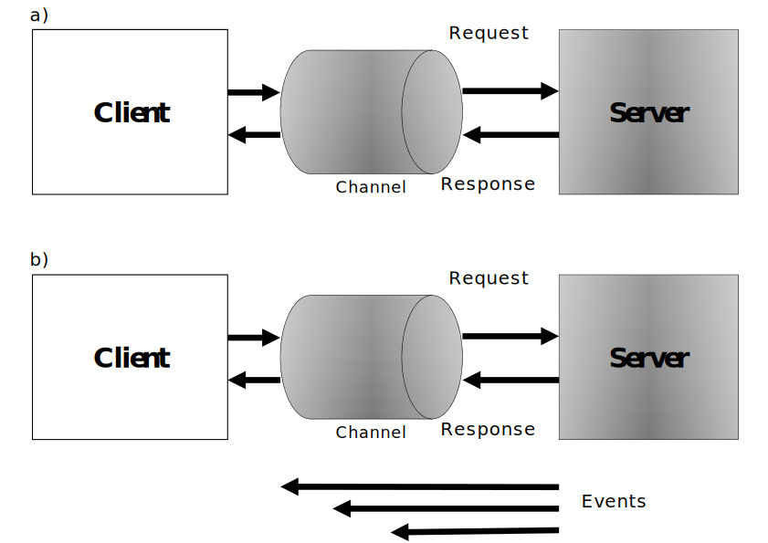

# Communication Patterns for Distributed Control Systems and IoT Devices

There are several communication models that can be used in a distributed control system. Each model has its pros and cons, therefore the system designer has to decide which model to employ for the implementation of the control system based on what each pattern offers. In this article, several communication patterns are reviewed and compared with each other to understand their use cases. In the following, a comparative analysis has been given for a number of common communication patterns, for the purpose of the appropriate employment in distributed control systems and IoT devices.

<figure markdown>

  
  <figcaption>Figure 1: a) Request-Response pattern, and b) Events pattern</figcaption>
</figure>

## 1) Request-Response
This communication model is one of the most commonly known models. It consists of a client that requests a service from a server, as shown in Figure 1 (a). It is a useful model for the client-server or master-slave architectures, however, a drawback of this model is the inequality of participants, which is apparent in the network topology. This makes it difficult for the bidirectional communication scenario, in which both the parties request information from each other, especially if firewalls are present. Consequently, either events, event-subscriptions, or security is difficult to manage, and require additional services and substantial resources if firewalls are used in the network.

## 2) Event-Subscription
This communication model allows a client to subscribe to events of a given type from a server. The server then informs the client each time the event is triggered, without having to constantly poll the server, as in Figure 1 (b). Advanced event-subscription mechanisms can include client-­specific requirements of when events are desired and under what conditions. The benefits of using this communication model are that half of the messages are not needed over time, and the latency of updates is kept to a minimum. The problem with this model is that it is not designed for the multiparty communication scenario. This can be further solved using the publish-subscribe model.

## 3) Multicasting
The previous models are primarily considered for the communication purposes between two entities. However, a more efficient model is required in cases when the same information has to be sent to multiple entities at the same time. Here, a sender sends one message through an intermediary (i.e., a broker or a router) which then distributes it to multiple recipients that have all requested participation in the communication. This model saves the bandwidth because the sender does not have to send individual messages to all the parties by itself. Also, the sender does not even have to know who the recipients are.

Although one can use this model in order to save the bandwidth, it is often used as a means of overcoming the restrictions in the chosen protocol, and its support of the event-subscription model, as well. In addition, multicasting is inherently difficult to secure, and it is more efficient in terms of the bandwidth only if the recipients actually use most of the transmitted values. In the case where frequent multicasting for decreasing the latency in the network is desired but not possible, the multicasting model might result in the increase rather than decrease in the required bandwidth.

## 4) Queues
The first-in, first-out queues, is a model that allows one or more entities to post the messages or tasks into a queue, and then lets one or more receivers receive the messages in an ordered fashion. The queues reside on an intermediary node or network to which all participants are connected. This model is an excellent tool for the load balancing purposes, where the collected tasks from multiple sources need to be distributed among the existing workers, perhaps having different performances. Queues can hardly be used for real-time communications in control systems, since the message should be saved at first, and then be processed at the controller via an intermediary node.

## 5) Publish-Subscribe
This communication model is an extension of the multicasting model, with the difference that messages transmitted are stored in the intermediary node. The messages, or a reference to the messages, are distributed to the corresponding subscribers, depending on the protocol. Also, only the latest message is stored, a given number of messages are stored, or all messages are stored in the intermediary, depending on the chosen protocol, as well as the settings of the intermediary. The difference between distributing the entire message and distributing only a reference to the message is important and affects the performance of the solution in terms of the consumed bandwidth. If the subscribers consume most of the messages, forwarding the messages themselves is more efficient, as in the case of multicasting. If, however, consumption occurs only on demand, then sending shorter references is more efficient because these messages are smaller and subscribers would use only a minority of them to fetch an actual message. In order to fetch a message in the latter case, a separate request-response action needs to be performed.

The behavior of each model has been analyzed from the control point of view. In this treatise, the publish-subscribe communication model is used for the practical implementation of the distributed event-based control strategy. In the publish-subscribe model, a node can act as a publisher, subscriber, or both simultaneously. The network roles can be dynamically changed to ensure a flexibility to reconfigure the directions of the data exchange. The main advantage of this model is that the data can be exchanged intelligently between the devices (i.e., the publishers send the data to the specific subscribers without having a subscription knowledge of each node). This keeps the setup process easier for the overall maintenance of the network, and enables the self-configuration of the devices, as one of the primary characteristics of the industrial ad-hoc networks. The process of selecting messages for the reception and processing is called filtering. The topic-based and content-based filtering are the two common forms of filtering used in new communication protocols introduced in the context of IoT. In the publish-subscribe network setup, a server manages the topics and contents, which is called a broker. The broker-free setup can be achieved with the distributed topics/contents suitable for the proposed distributed control structure. The topic-based publish-subscribe communication model also enables the selective message distribution among a number of sources and sinks. Messages are associated with the topics and are selectively routed to destinations with matching topic interests. Subscribers show their interest in receiving data with a given topic and data sources publish messages on the topics.

## Conclusion
In general, publish-subscribe communication is a potential solution the requirements of distributed control systems and IoT devices, however, the existence of a broker might increase communication delay in the feedback loop. The main advantages of the publish-subscribe communication model compared with the aforementioned models can be summarized as:

- Adaptive role change in a dynamic environment from the publisher to the subscriber and vice versa.
- Intelligent data exchange among the nodes without having a subscription knowledge of each node.
- Automatic self-configuration of the nodes in the ad-hoc network without a central configurator which enables the plug and play operation of the control system.
- Intrinsic discrete event transmission support which suits it as an ideal choice for the event-triggered control.

## References

[[1] S. A. Alavi, K. Mehran, Y. Hao, A. Rahimian, H. Mirsaeedi and V. Vahidinasab, "A Distributed Event-Triggered Control Strategy for DC Microgrids Based on Publish-Subscribe Model Over Industrial Wireless Sensor Networks," in IEEE Transactions on Smart Grid, vol. 10, no. 4, pp. 4323-4337, July 2019.](https://ieeexplore.ieee.org/abstract/document/8444726)

[[2] S. Amir Alavi, A. Rahimian, K. Mehran and J. Mehr Ardestani, "An IoT-Based Data Collection Platform for Situational Awareness-Centric Microgrids," 2018 IEEE Canadian Conference on Electrical & Computer Engineering (CCECE), 2018, pp. 1-4.](https://ieeexplore.ieee.org/abstract/document/8447718)